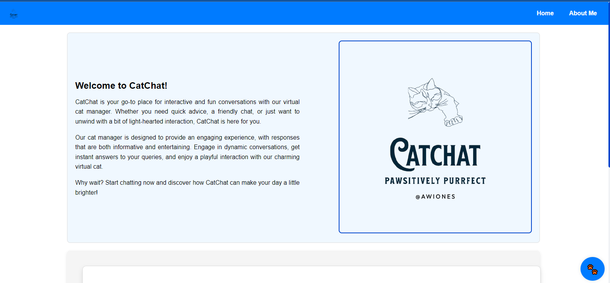

   
  

  

# CatChat Website

Welcome to CatChat! This website is designed to provide a fun and interactive chatting experience with a virtual cat manager. Below you'll find details about the features and functionalities of the website.

## Features

### 1. Chat with Cat Manager
- **Interactive Chat**: Engage in a conversation with the Cat Manager. The cat provides various responses, randomly selected from a predefined list.
- **Typing Indicator**: Simulate the cat "typing" before sending a response, adding a realistic touch to the interaction.

### 2. Main Page
- **Introduction Box**: A welcoming box explaining the purpose of chatting with the manager and why it's beneficial.
- **Logo and Description**: A box with a large logo and a description about "CatChat" on the main page.

### 3. Responsive Design
- **Mobile and Desktop**: The website is designed to be responsive, ensuring a good user experience on both mobile and desktop devices.

### 4. User Interface Enhancements
- **Stylish Design**: Modern, clean design with animated elements and a visually appealing layout.
- **Text Effects**: Non-selectable text to maintain a polished look, and enhanced readability with justified text and highlighted sections.

## Usage

1. **Chat Interaction**
   - Click on the chat icon to open the chat box.
   - Type your message and hit "Send" or press Enter to communicate with the Cat Manager.

2. **Explore About Me**
   - Visit the "About Me" page to learn more about the creator and their work.

3. **Main Page Interaction**
   - View the introductory information and explore the features of CatChat.
  
## Screenshots

  

  

## Technologies Used

- **HTML5**: Structure of the web pages.
- **CSS3**: Styling and layout.
- **JavaScript**: Dynamic functionalities and interactions.
- **Local Storage**: For storing chat history.

## Future Plans

- Improve chat responses and add more interactive elements.
- Enhance the About Me page with additional content and design improvements.
- Add more features and refine the user interface based on feedback.

## Contributing

Contributions are welcome! If you have suggestions, improvements, or bug fixes, please submit a pull request or open an issue.

- **Fork the Repository**: Create a personal copy of the repository on GitHub.
- **Make Changes**: Implement your changes and test them locally.
- **Submit a Pull Request**: Describe your changes and submit a pull request for review.

Feel free to use, modify, and build upon this project. If you make any improvements or modifications, please give credit to the original creator.

## License

This project is licensed under the MIT License. See the [LICENSE](LICENSE) file for details.

---

Made with ❤️ by Awiones

